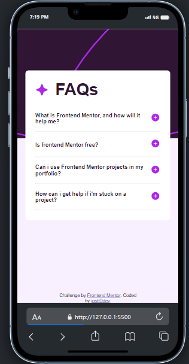
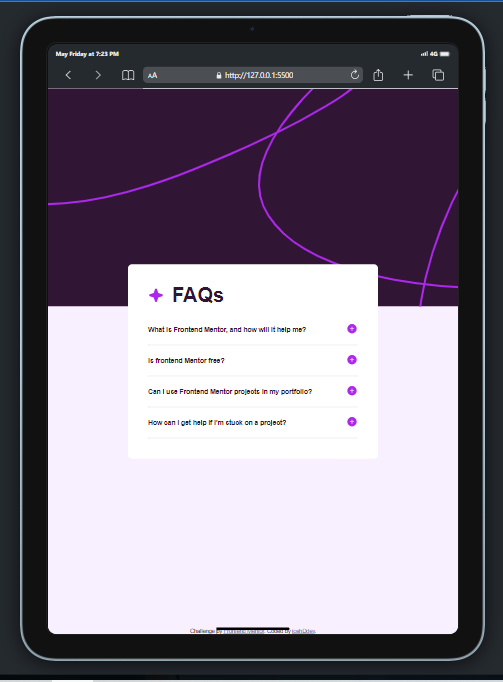
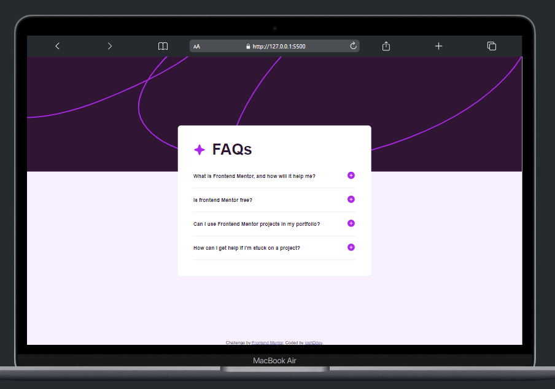

# Frontend Mentor - FAQ accordion solution

This is a solution to the [FAQ accordion challenge on Frontend Mentor](https://www.frontendmentor.io/challenges/faq-accordion-wyfFdeBwBz). Frontend Mentor challenges help you improve your coding skills by building realistic projects. 

## Table of contents

- [Overview](#overview)
  - [The challenge](#the-challenge)
  - [Screenshot](#screenshot)
  - [Links](#links)
- [My process](#my-process)
  - [Built with](#built-with)
  - [What I learned](#what-i-learned)
  - [Continued development](#continued-development)
- [Author](#author)

**Note: Delete this note and update the table of contents based on what sections you keep.**

## Overview

### The challenge

Users should be able to:

- Hide/Show the answer to a question when the question is clicked
- Navigate the questions and hide/show answers using keyboard navigation alone
- View the optimal layout for the interface depending on their device's screen size
- See hover and focus states for all interactive elements on the page

### Screenshot

### Links

- Solution URL: (https://www.frontendmentor.io/challenges/faq-accordion-wyfFdeBwBz/hub)
- Live Site URL: (https://joshbolu.github.io/faq-accordion-main/)

## My process

### Built with

- Semantic HTML5 markup
- CSS custom propertie
- Desktop-first workflow

### What I learned

I learnt how important tab indexes are in your website allowing users be able use the website just with keyboard alone, learning how to make the the website interaction with the tab key and enter to perform the action. This discovery allowed me to be able to check how i can make that happen using javascript and placing tabindex in my html code to equip elements that don't naturally have this feature to have them.

I was also happy with the way i got to know how to manipulate svg elements using js.

To see how you can add code snippets, see below:

### Continued development

i really want to focus on improving my tab indexing because i believe they can make my website hold more greater value 

## Author

- Website - [Add your name here](https://www.your-site.com)
- Frontend Mentor - [@yourusername](https://www.frontendmentor.io/profile/yourusername)
- Twitter - [@yourusername](https://www.twitter.com/yourusername)

**Note: Delete this note and add/remove/edit lines above based on what links you'd like to share.**